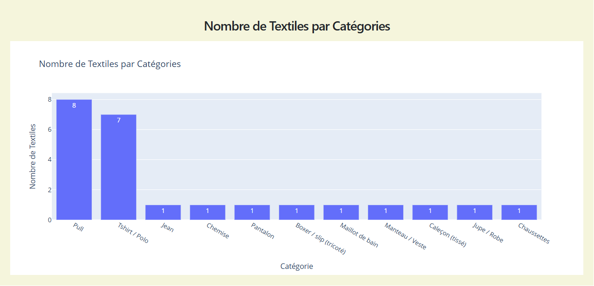
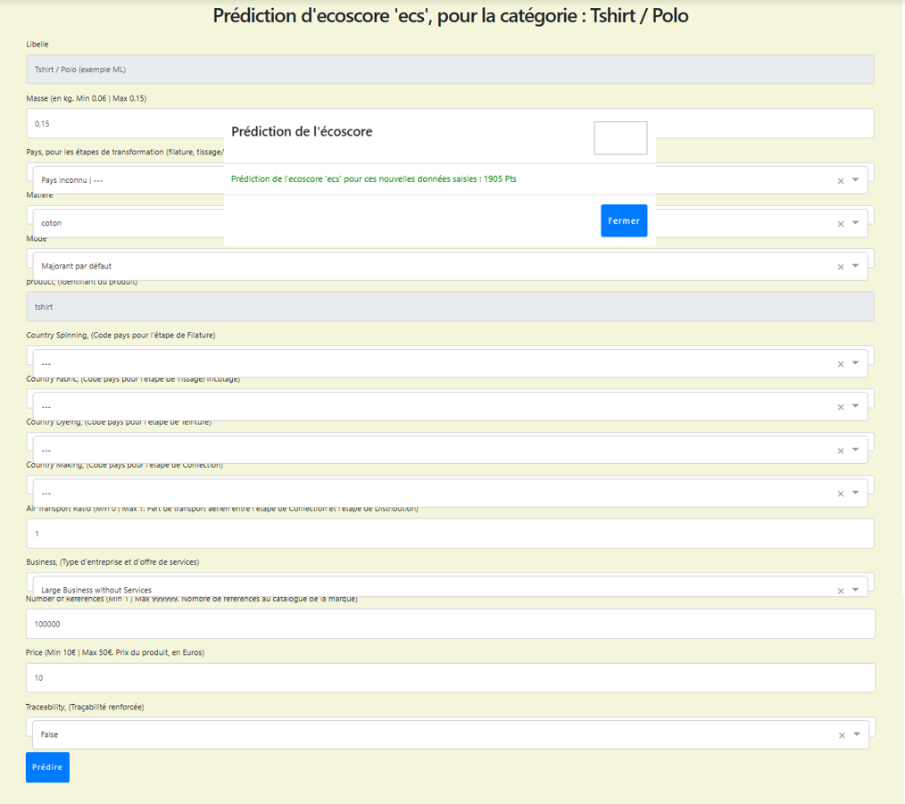
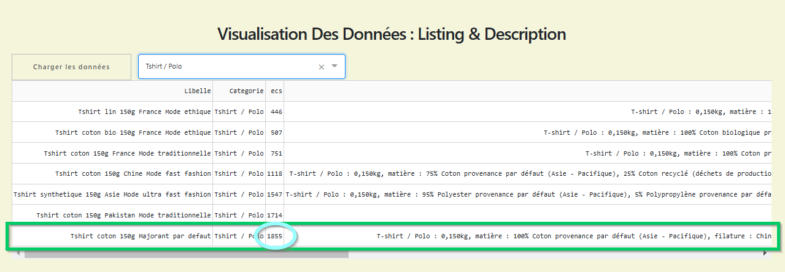
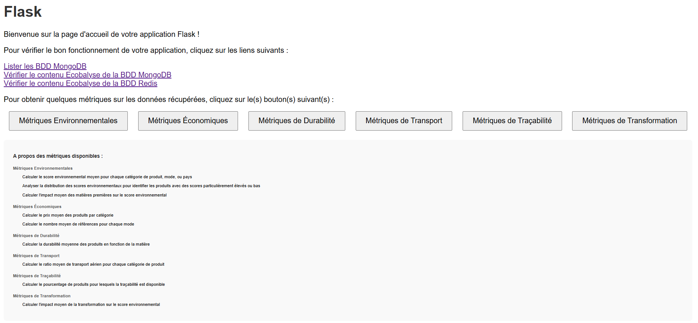
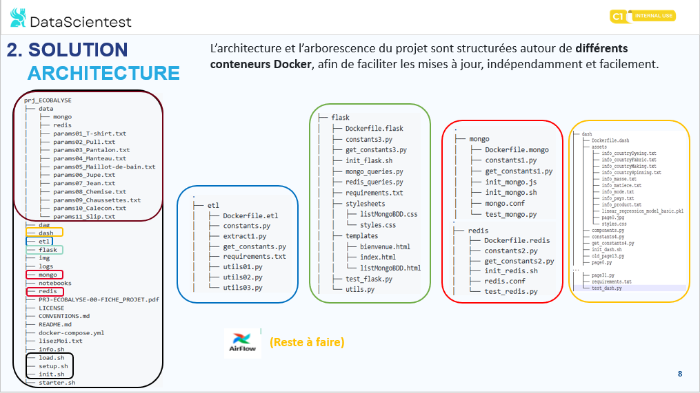

<a name="debut" />


# Datascientest: [projet EcoBalyse](./PRJ-ECOBALYSE-00-FICHE_PROJET.pdf) (Nov. 2024)
> *Data Engineering End-to-End Project : AirFlow, Dash, Flask, Docker, Redis, MongoDB, Python* <br />

Dernière Mise A Jour du Document : Dim. 17/11/2024 - Version : v0.2.0

## [Sommaire](#debut)
- [Contexte](#tdm-01)
- [Présentation](#tdm-02)
    - [Etapes du projet](#tdm-02-01)
- [Mode d'emploi](#tdm-03)
    - [Pré-requis (`./info.sh` | `./mode.sh` | `./starter.sh`)](#tdm-03-01)
    - [(Ré)Initialiser (`./init.sh`)](#tdm-03-02)
    - [(Re)Configurer (`./setup.sh`)](#tdm-03-03)
    - [(Re)Charger (`./load.sh`)](#tdm-03-04)
- [Solution technique](#tdm-05)
    - [Schéma de Principe](#tdm-05-01)
    - [Dossiers & Répertoires](#tdm-05-02)
- [A propos d'Ecobalyse](#tdm-06)

## <a name="tdm-01" />[Contexte](#debut)
Ce projet a été réalisé dans le cadre de la <b>formation Data Engineer</b>, proposée par :  
<a href="https://datascientest.com/formation-data-engineer" target="_blank">Datascientest, et l'Ecole des Mines ParisTech</a>.

Le *[cursus pédagogique](./img/DATASCIENTEST_ParcoursPedagogique.png)* de la <b>formation Data Engineer</b> s'inscrit dans le cadre de la **[certification n°RNCP36129](https://www.francecompetences.fr/recherche/rncp/36129/)** :  
*“Chef de projet en intelligence artificielle / (Machine Learning Engineer)”, Niveau 7 (bac + 5)*.  

L'équipe ayant réalisé ce projet se compose de :
* SERDYUK Alexandra
* BENALLEGUE Anis
* DELIGNE Thierry

Le **Rapport Final**, expliquant tout le workflow décisionnel du projet, est disponible : [ici](./ecblRapport.pdf).

Les **Machines Virtuelles** (VM *DataScientest*) disponibles pour le projet sont :
* VMa Ubuntu Server 20.04 LTS	 4Go RAM	16Go DD : https://learn.datascientest.com/lesson/801/2838	(Redis)
* VMb Ubuntu Server 20.04 LTS	16Go RAM	25Go DD : https://learn.datascientest.com/lesson/349/3682	(AirFlow)

## <a name="tdm-02" />[Présentation](#debut)
Basé sur les données, et l'`API` de calcul des impacts environnementaux d'[Ecobalyse v2.4.0](https://ecobalyse.beta.gouv.fr/), ce projet doit permettre : 
- d'obtenir une évaluation de l'impact écologique de textiles courants
- de fournir des recommandations ou des conseils sur des alternatives plus durables

<br />


### <a name="tdm-02-01" />[Etapes du projet](#tdm-02)

> 💬 **Nota : Par défaut, la récolte des données se fait en mode `Basic`.** <br />
> Lancer le script `./mode.sh -f` pour définir une récolte des données en mode `Complet`.

- **Etape 01 : récolte des données** <br />
[Extraction](notebooks/PRJ-ECOBALYSE-01-ETAPE-01-BASIC_v0-20.ipynb) (mode `Basic`), [Transformation](notebooks/PRJ-ECOBALYSE-02-ETAPE-01-FULL_v0-20.ipynb) (mode `Complet`)

    - Identification de la source de données
    - Connexion et importation des données

- **Etape 02 : architecture & stockage**

    - Choix d'un SGBD adapté au problème
    - Modélisation des tables/collections/index

- **Etape 03 : consommation des données** <br />
`Visualisations` (mode: [Basic](notebooks/PRJ-ECOBALYSE-03-ETAPE-03-VISU-BASIC_v0-20.ipynb) | [Complet](notebooks/PRJ-ECOBALYSE-04-ETAPE-03-VISU-FULL_v0-20.ipynb)) , `Prédictions` (mode: [Basic](notebooks/PRJ-ECOBALYSE-05-ETAPE-03-ML-BASIC_v0-20.ipynb) | [Complet](notebooks/PRJ-ECOBALYSE-06-ETAPE-03-ML-FULL_v0-20.ipynb))

    - Dashboard ou Algorithme de Machine Learning (périmètre du *Data Scientist/Analyst*)

- **Etape 04 : mise en production**

    - Création de l'API du projet
    - Dockerisation de tout le projet

- **Etape 05 : automatisation des flux (<i>Etape facultative</i>)**

    - Automatisation des tâches avec AirFlow

## <a name="tdm-03" />[Mode d'emploi](#debut)

### <a name="tdm-03-01" />[Pré-requis (`./info.sh` | `./mode.sh` | `./starter.sh`)](#tdm-03)

| 💬 Avertissement ! Le client Docker doit être installé sur la machine virtuelle. |
|----------|
| Pour (ré)installer, ou mettre à jour le client **Docker**, consulter le fichier [lisezMoi.txt](./lisezMoi.txt). | 

> 💬 **Nota : action préalable facultative à l'extraction des données Ecobalyse** <br />
> Une fois le dépôt GitHub recopié, vous pouvez spécifier le **mode d'extraction des données** *(Basic | Complet)* depuis le script :
> `./mode.sh`.

> **Résumé du(des) script(s) utile(s)**
>
> - `./info.sh -v` # affiche la version du client Docker installé (nota: ./info.sh <b>-?</b> renvoie les options disponibles)
> - `./info.sh -i` # affiche la liste des images Docker présentes 
> - `./info.sh -a` # affiche la liste des conteneurs Docker actifs
> - `./info.sh -df` # affiche l'espace disque disponible
>
> **Résumé du(des) script(s) facultatif(s)**
>
> - `./mode.sh -f` # configure le mode d'extraction **(Complet)** des données Ecobalyse. Fixe le nombre de données aléatoires, par catégories de textiles.
> - `./mode.sh` # configure le mode d'extraction **(Basic)** des données Ecobalyse. 
> - `./starter.sh -i` # vérifie l'extraction des Données Ecobalyse (nota: ./starter.sh <b>-?</b> renvoie les options disponibles)
> - `./starter.sh` # idem : vérifie l'extraction des Données Ecobalyse

#### Configurer VS Code

- installer [VS Code](https://code.visualstudio.com/) localement sur votre PC, en fonction de votre système d'exploitation.

- configurer [VS Code](https://code.visualstudio.com/) pour pouvoir accéder, via <i>SSH</i>, à la machine virtuelle DataSientest.

#### Lancer la machine virtuelle

- accéder, puis lancer la machine virtuelle DataScientest, depuis le lien : <br /> `https://learn.datascientest.com/lesson/349/3682`

#### Recopier le dépôt Github

- recopier le dépôt GitHub sur la machine virtuelle, par la commande : <br /> `git clone https://github.com/dte-thierry/prj_ECOBALYSE.git`

#### Vérifier la version  

- au besoin, depuis le répertoire <i><b>~/prj_ECOBALYSE</i></b>, une fois le dépôt GitHub recopié, lancer le script : <br />
`./info.sh -v`, pour vérifier la version du client Docker installé. (nota: `./info.sh -?` renvoie les options disponibles)

#### 💬 Facultatif 

- Le mode d'extraction des données (Basic | Complet) **peut être choisi au préalable** de l'extraction <i>"standard" des données</i> Ecobalyse. Lancer le script `./mode.sh`, pour préciser votre choix. (nota: `./mode.sh -?` renvoie les options disponibles)

- puis, depuis le répertoire <i><b>~/prj_ECOBALYSE</i></b>, lancer le script `./starter.sh -i` pour tester l'extraction <i>"standard"</i> (hors conteneur **Docker**) des données Ecobalyse.
  
- via [VS Code](https://code.visualstudio.com/), depuis le répertoire */logs*, consulter le contenu du fichier `'manual_webscraping_(date).log'`, pour vérifier le résultat obtenu.

##### 💬 Nota 

Vous pouvez lancer le script `./starter.sh`, <b>sans aucune option</b>. 

En lançant le script `./starter.sh -i`, en fonction du **mode d'extraction des données** (Basic | Complet), vous obtiendrez les messages d'avertissement suivants :

###### Mode Basic

```bash
--------------------------------------------------------------
ETAPE 01 : Récupération des Données via l'API Ecobalyse v2.4.0
--------------------------------------------------------------
VM utilisée, à l'adresse IP / SSH publique : 54.154.13.241

Mode d'Extraction Des Données : Basic. 
Fichier JSON à créer : PRJ-ECOBALYSE-TEXTILES_basic.json

Avertissement:
--------------
L'API d'Ecobalyse est actuellement non finalisée, toujours en cours de développement.
Ce projet se base sur l'API d'Ecobalyse : v2.4.0 pour récupérer les données.
Soyez attentif et vigilant à la récupération des données Ecobalyse obtenues, via l'API.
Consultez dans le répertoire /logs, le fichier .log : (manual|docker)_webscraping_(aaaa-mm-jj_hh-mn).log.
Vérifiez qu'aucune description de textile (colonne 'description') ne soit de type : NaN


DataFrame, fichiers 'log' et 'json' PRJ-ECOBALYSE-TEXTILES_basic.json créés avec succès, en mode basic.
```

###### Mode Complet

```bash
--------------------------------------------------------------
ETAPE 01 : Récupération des Données via l'API Ecobalyse v2.4.0
--------------------------------------------------------------
VM utilisée, à l'adresse IP / SSH publique : 54.154.13.241

Mode d'Extraction Des Données : Complet, avec ajout et transformation de données aléatoires. 
Fichier JSON à créer : PRJ-ECOBALYSE-TEXTILES_full.json

Avertissement:
--------------
L'API d'Ecobalyse est actuellement non finalisée, toujours en cours de développement.
Ce projet se base sur l'API d'Ecobalyse : v2.4.0 pour récupérer les données.
Soyez attentif et vigilant à la récupération des données Ecobalyse obtenues, via l'API.
Consultez dans le répertoire /logs, le fichier .log : (manual|docker)_webscraping_(aaaa-mm-jj_hh-mn).log.
Vérifiez qu'aucune description de textile (colonne 'description') ne soit de type : NaN


DataFrame, fichiers 'log' et 'json' PRJ-ECOBALYSE-TEXTILES_full.json créés avec succès, en mode complet.
```

### <a name="tdm-03-02" />[(Ré)Initialiser (`./init.sh`)](#tdm-03)

> **Résumé du(des) script(s) utile(s)**
>
> - `./init.sh` # supprime toutes les données (si elles existent) et (ré)initialise totalement la configuration du projet

#### Supprimer les conteneurs

Depuis le répertoire <i><b>~/prj_ECOBALYSE</i></b> :

- lancer le script `./init.sh` pour supprimer toutes les données (*logs* et *json*), et tous les conteneurs, images, volumes, réseaux inutilisés.

### <a name="tdm-03-03" />[(Re)Configurer (`./setup.sh`)](#tdm-03)

> **Résumé du(des) script(s) utile(s)**
>
> - `./setup.sh` # supprime les fichiers *.log*, et (re)lance les différents conteneurs du projet 
> - `./info.sh -logs` # visualise les logs des conteneurs actifs : *ecblwebscraping* , *ecblmongodb* , *ecblredis* 
>
> **Résumé du(des) script(s) facultatif(s)**
>
> - `./setup.sh -json` # supprime les fichiers *.log*, **les fichiers *.json*,** et (re)lance les différents conteneurs du projet 

#### Lancer les services

- lancer le script `./setup.sh` pour supprimer les fichiers *.log*, et (re)lancer les différents conteneurs du projet.

#### Visualiser les logs des conteneurs actifs

- puis, lancer le script `./info.sh -logs` pour visualiser les logs des conteneurs (re)lancés : *ecblwebscraping* , *ecblmongodb* , *ecblredis*.

#### Consulter les fichiers .log

- via [VS Code](https://code.visualstudio.com/), consulter le contenu des fichiers .log, pour vérifier que l'environnement de stockage `MongoDB` / `Redis` est fonctionnel. 
    - `'docker_webscraping_(date).log'` : pour visualiser l'extraction des données Ecobalyse, par les services
    - `'docker_testmongodb_(date).log'` : pour visualiser l'accès à MongoDB (et requêtes initiales) par les services
    - `'docker_testredis_(date).log'` : pour visualiser l'accès à Redis (et requêtes initiales) par les services

#### 💬 Facultatif 

- au besoin, lancer le script `./setup.sh -json` pour supprimer les fichiers *.log*, **les fichiers *.json*,** et (re)lancer les différents conteneurs du projet


### <a name="tdm-03-04" />[(Re)Charger (`./load.sh`)](#tdm-03)

> **Résumé du(des) script(s) utile(s)**
>
> - `./load.sh` # accède via un *navigateur Web* au Framework **Dash** 
> - `./load.sh -adm` # accède via un *navigateur Web* au Framework **Flask** 

#### Lancer Dash

- lancer le script `./load.sh` pour lancer `Dash` via un *navigateur Web*. <br />

- via [VS Code](https://code.visualstudio.com/), consulter le contenu du fichier .log, pour vérifier que l'application `Dash` est active. <br />
    - `'docker_testdash_(date).log'` 

<br />

La page d'accueil `Dash` s'affiche avec les informations suivantes :


Deux boutons sont disponibles : `[Visualisation(s)]` , `[Prédiction(s)]`. 

Cliquer sur l'un ou l'autre des boutons, selon l'utilisation désirée.

##### **💬 Exemple de `[Visualisation(s)]`**



##### **💬 Exemple de `[Prédiction(s)]`**



La prédiction de l'impact environnemental 'ecs', déduite par le **[modèle de régression linéaire](img/PRJ-ECOBALYSE-00-IMG8.png)** est : `1905 Pts`. 

En comparaison, pour ce même textile, la valeur 'ecs' calculée par [l'API Ecobalyse](https://ecobalyse.beta.gouv.fr/#/api) est : `1855 Pts`.



##### 💬 Nota 

Lorsque le Framework Web `Dash` est démarré, via le conteneur *ecbldash*, on peut y accéder depuis un navigateur Web : <br />

- soit par l'adresse locale : 127.0.0.1:8050/
- soit par l'adresse IP / SSH publique de la VM, par exemple : 3.252.141.140:8050/

<br />

#### Lancer Flask

- lancer le script `./load.sh -adm` pour lancer `Flask` via un *navigateur Web*. <br />

- via [VS Code](https://code.visualstudio.com/), consulter le contenu du fichier .log, pour vérifier que l'application `Flask` est active. <br />
    - `'docker_testflask_(date).log'` 

<br />

La page d'accueil `Flask` s'affiche avec les informations suivantes :




##### 💬 Nota 

Lorsque le Framework Web `Flask` est démarré, via le conteneur *ecblflask*, on peut y accéder depuis un navigateur Web : <br />

- soit par l'adresse locale : 127.0.0.1:5050/
- soit par l'adresse IP / SSH publique de la VM, par exemple : 3.252.141.140:5050/

## <a name="tdm-05" />[Solution technique](#debut)

### <a name="tdm-05-01" />[Schéma de principe](#tdm-05)


La solution proposée se compose de : 

* Un `ETL` qui a la charge de récupérer les contenus d'Ecobalyse.

* Une base de données `MongoDB` où sont entreprosées les données récupérées.
  
* Une base de données `Redis` utilisée comme mémoire cache, afin d'accélérer les requêtes.

* Un dashboard `Dash` qui permet de *visualiser des informations statistiques* sur les données recueillies, et d'effectuer des *prédictions* de <b>Machine Learning</b>, à partir d'un modèle `scikit-learn` entraîné.

* Un Framework Web `Flask` qui sert d’intermédiaire (API) entre les bases de données `MongoDB` / `Redis`, et qui propose quelques métriques sur les données (*certaines métriques n'ont pas été traitées en date, et restent à faire*).

* Un DAG `Airflow` pour gérer l'orchestration de l'ETL (*cette partie n'a pas été traitée en date, et reste à faire*).

### <a name="tdm-05-02" />[Dossiers & Répertoires](#tdm-05)



## <a name="tdm-06" />[A propos d'Ecobalyse](#debut)
__Écobalyse__ est un outil développé par l'État français pour calculer l'impact écologique des produits textiles et alimentaires distribués en France. Il vise à fournir des informations sur l'empreinte environnementale de ces produits, permettant ainsi aux consommateurs de prendre des décisions plus éclairées  et durables sur leurs choix de consommation. 
    
En lien avec les préoccupations actuelles (l'industrie textile est l'une des plus polluantes au monde), __Écobalyse__ vise à accélérer la mise en place de l'affichage environnemental, pour favoriser un modèle de production plus durable.
    
__Voici quelques points clés à propos d'Écobalyse__ :
    
- `Objectif` : __Écobalyse__ permet de comprendre et de calculer les impacts écologiques des produits distribués en France.

- `Éco-score` : __Écobalyse__ propose un éco-score pour informer les consommateurs sur l'impact environnemental des produits qu'ils achètent.    
    
- `Collaboration ouverte` : __Écobalyse__ est un mode de collaboration ouvert à la critique et aux suggestions, dans le but d'aider à élaborer la future méthode réglementaire française.

- [`API ouverte`](https://api.gouv.fr/les-api/api-ecobalyse) : __Écobalyse__ propose une __interface de programmation applicative__ (__API__) pour connecter le calculateur Écobalyse à d'autres services numériques. L'[__API__](https://api.gouv.fr/les-api/api-ecobalyse) est testée dans le cadre de l'expérimentation Xtex, conformément à la loi Climat et Résilience.
    
    Ci-après quelques exemples d'utilisation de l'[__API__](https://api.gouv.fr/les-api/api-ecobalyse) __Écobalyse__ pour estimer les impacts environnementaux des produits textiles : 
    
        1. Interroger la base de données des indicateurs d'impacts environnementaux des produits textiles. 
        Récupérer des informations sur les impacts environnementaux d'un vêtement en fonction de critères tels que 
        la traçabilité, la matière et le recyclage.
    
        2. Calculer les impacts pour chaque produit.
        Estimer, pour chaque produit textile : l'impact carbone, l'impact sur la couche d'ozone, l'impact sur la 
        qualité de l'eau, le coût énergétique, l'impact sur l'eutrophisation de l'eau et des terres, l'impact sur 
        l'acidification terrestre des eaux douces, l'utilisation du sol, l'utilisation de minéraux. 

        3. Tester le simulateur.
        Explorer les impacts environnementaux de différents produits textiles.
    
Toutes marques, producteurs, ou distributeurs peutvent contribuer à améliorer le calcul d'impacts écologiques, en partageant leurs données et en participant aux travaux collectifs.
    
Pour en savoir plus, on peut visiter le site d'__Écobalyse__ [ici](https://ecobalyse.beta.gouv.fr/). 

__A voir également :__

- [GitBook `Écobalyse`](https://fabrique-numerique.gitbook.io/ecobalyse)
- [Explorateur `Écobalyse`](https://ecobalyse.beta.gouv.fr/#/explore/textile/processes)    
- [Documentation de `API` Écobalyse](https://api.gouv.fr/documentation/api-ecobalyse)
- [Ademe](https://affichage-environnemental.ademe.fr/)


[(Retour au début)](#debut)
