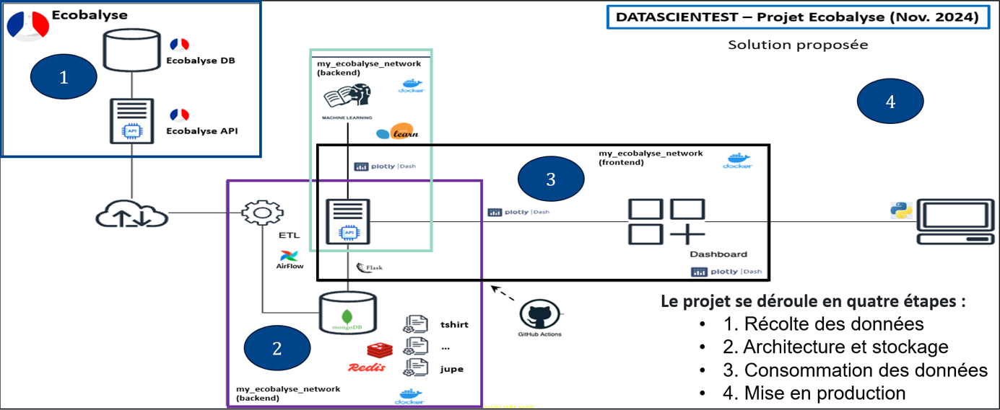

<a name="debut" />


# Datascientest: [projet EcoBalyse](./PRJ-ECOBALYSE-00-FICHE_PROJET.pdf) (Nov. 2024)

## [Sommaire](#debut)
- [Contexte](#tdm-01)
- [Présentation](#tdm-02)
- [Mode d'emploi](#tdm-03)
- [Etapes du projet](#tdm-04)
- [Solution technique](#tdm-05)
- [A propos d'Ecobalyse](#tdm-06)

## <a name="tdm-01" />[Contexte :](#debut)
Ce projet a été réalisé dans le cadre de la formation continue de Data Engineer, proposée par :  
<a href="https://datascientest.com/formation-data-engineer" target="_blank">Datascientest et l'Ecole des Mines ParisTech</a>.

L'équipe ayant réalisé ce projet se compose de :
* SERDYUK Alexandra
* BENALLEGUE Anis
* DELIGNE Thierry

## <a name="tdm-02" />[Présentation](#debut)
Basé sur les données, et l'`API` de calcul des impacts environnementaux d'[Ecobalyse v2.4.0](https://ecobalyse.beta.gouv.fr/), ce projet permet : 
- d'obtenir une évaluation de l'impact écologique de textiles courants
- potentiellement, de fournir des recommandations ou des conseils sur des alternatives plus durables

<br />


## <a name="tdm-03" />[Mode d'emploi](#debut)

### Pré-requis

- installer [VS Code](https://code.visualstudio.com/) localement sur votre PC, en fonction de votre système d'exploitation.

- configurer `VS Code` pour pouvoir accéder, via <i>SSH</i>, à la machine virtuelle DataSientest.

- lancer et accéder à la machine virtuelle DataScientest, depuis le lien : <br />
*https://learn.datascientest.com/lesson/349/3682*

- recopier le dépôt GitHub sur la machine virtuelle, par la commande : <br />
*git clone https://github.com/dte-thierry/prj_ECOBALYSE.git*

- au besoin, lancer le script `info.sh` <b>-logs</b>, pour afficher les logs des conteneurs actifs, par la commande : <br />
*./info.sh <b>-logs</b>* (nota: ./info.sh <b>-?</b> renvoie les options disponibles)

<br />
Puis, depuis le répertoire <i><b>~/prj_ECOBALYSE</i></b> :

- au besoin, lancer le script `stop.sh` pour arrêter les services, par la commande : <br />
*./stop.sh*

- au besoin, lancer le script `reset.sh` pour supprimer tous les conteneurs, images, volumes, et réseaux inutilisés, par la commande : <br />
*./reset.sh*

#### Facultatif :

- (au besoin, lancer le script `start.sh` <b>-i</b>, pour exécuter une extraction <i>"manuelle"</i> des données Ecobalyse, par la commande : <br />
*./start.sh <b>-i</b>*)

- (via [VS Code](https://code.visualstudio.com/), consulter le contenu du fichier .log  `'manual_webscraping_(date).log'`, pour vérifier l'extraction des données Ecobalyse. <br />

##### Nota :

Vous pouvez lancer le script `start.sh`, <b>sans aucune option</b> <i>(nota: ./start.sh <b>-?</b> renvoie les options disponibles)</i>, par la commande : *./start.sh* <br />
En lançant le script `start.sh` avec l'option `-i`, vous obtiendrez un message d'avertissement de type :

```bash
--------------------------------------------------------------
ETAPE 01 : Récupération des Données via l'API Ecobalyse v2.4.0
--------------------------------------------------------------
VM en cours, à l'adresse IP / SSH publique : xxx.xxx.xxx.xxx

Avertissement:
--------------
L'API d'Ecobalyse est actuellement non finalisée, toujours en cours de développement.
Ce projet se base sur l'API d'Ecobalyse : v2.4.0 pour récupérer les données.
Soyez attentif et vigilant à la récupération des données Ecobalyse obtenues, via l'API.
Consultez dans le répertoire /logs, le fichier .log : (manual|docker)_webscraping_(aaaa-mm-jj_hh-mn).log.
Vérifiez qu'aucune description de textile (colonne 'description') ne soit de type : NaN

DataFrame, fichiers 'log' et 'json' créés avec succès, manuellement.
```

### Lancement

#### Lancer les services

- lancer le script `setup.sh` pour activer les différents conteneurs et services nécessaires au projet, par la commande : <br />
*./setup.sh*

- via [VS Code](https://code.visualstudio.com/), consulter le contenu des fichiers .log, pour vérifier que l'architecture de stockage `MongoDB` / `Redis` est fonctionnelle. <br />
    - `'docker_webscraping_(date).log'` : pour visualiser l'extraction des données Ecobalyse, par les services
    - `'docker_testmongodb_(date).log'` : pour visualiser l'accès à MongoDB et requêtes initiales, par les services
    - `'docker_testredis_(date).log'` : pour visualiser l'accès à Redis et requêtes initiales, par les services

- lancer le script `info.sh` <b>-logs</b>, pour visualiser les logs des conteneurs actifs, par la commande : <br />
*./info.sh <b>-logs</b>*

##### Nota :

En lançant le script `info.sh` avec l'option `-logs` <i>(nota: ./info.sh <b>-?</b> renvoie les options disponibles)</i>, vous visualiserez les logs des différents conteneurs, par exemple :

conteneur : ecblwebscraping
```bash
Affichage des logs du conteneur : ecblwebscraping...
Attaching to ecblwebscraping
ecblwebscraping    | --------------------------------------------------------------
ecblwebscraping    | ETAPE 01 : Récupération des Données via l'API Ecobalyse v2.4.0
ecblwebscraping    | --------------------------------------------------------------
ecblwebscraping    | VM utilisée, à l'adresse IP / SSH publique : 18.201.106.14
ecblwebscraping    | DataFrame, fichiers 'log' et 'json' créés avec succès, par le conteneur.
ecblwebscraping    | 
ecblwebscraping    |
```

conteneur : ecblmongodb
```bash
Affichage des logs du conteneur : ecblmongodb...
Attaching to ecblmongodb
ecblmongodb        | ------------------------------------------------------------
ecblmongodb        | ETAPE 02 : Stockage des Données Ecobalyse v2.4.0 via MongoDB
ecblmongodb        | ------------------------------------------------------------
ecblmongodb        | VM utilisée, à l'adresse IP / SSH publique : 18.201.106.14
ecblmongodb        | 
ecblmongodb        | about to fork child process, waiting until server is ready for connections.
ecblmongodb        | forked process: 15
ecblmongodb        | child process started successfully, parent exiting
ecblmongodb        | MongoDB shell version v5.0.30
ecblmongodb        | connecting to: mongodb://127.0.0.1:27017/?compressors=disabled&gssapiServiceName=mongodb
ecblmongodb        | Implicit session: session { "id" : UUID("42c41132-a00e-49d8-8fa8-db77bd20c579") }
ecblmongodb        | MongoDB server version: 5.0.30
ecblmongodb        | ================
ecblmongodb        | Warning: the "mongo" shell has been superseded by "mongosh",
ecblmongodb        | which delivers improved usability and compatibility.The "mongo" shell has been deprecated and will be removed in
ecblmongodb        | an upcoming release.
ecblmongodb        | For installation instructions, see
ecblmongodb        | https://docs.mongodb.com/mongodb-shell/install/
ecblmongodb        | ================
ecblmongodb        | switched to db admin
ecblmongodb        | bye
ecblmongodb        | MongoDB shell version v5.0.30
ecblmongodb        | connecting to: mongodb://127.0.0.1:27017/?compressors=disabled&gssapiServiceName=mongodb
ecblmongodb        | Implicit session: session { "id" : UUID("e09b9ab9-9e34-46b3-9a77-0c3220c68cc7") }
ecblmongodb        | MongoDB server version: 5.0.30
ecblmongodb        | 
ecblmongodb        | Base De Données MongoDB et fichier 'log' créés avec succès, par le conteneur.
ecblmongodb        | 
```

conteneur : ecblredis
```bash
Affichage des logs du conteneur : ecblredis...
Attaching to ecblredis
ecblredis          | ----------------------------------------------------------
ecblredis          | ETAPE 02 : Stockage des Données Ecobalyse v2.4.0 via Redis
ecblredis          | ----------------------------------------------------------
ecblredis          | VM utilisée, à l'adresse IP / SSH publique : 18.201.106.14
ecblredis          | 
ecblredis          | 13:C 30 Oct 2024 15:45:48.651 * oO0OoO0OoO0Oo Redis is starting oO0OoO0OoO0Oo
ecblredis          | 13:C 30 Oct 2024 15:45:48.651 * Redis version=7.4.1, bits=64, commit=00000000, modified=0, pid=13, just started
ecblredis          | 13:C 30 Oct 2024 15:45:48.651 * Configuration loaded
ecblredis          | 13:M 30 Oct 2024 15:45:48.652 * monotonic clock: POSIX clock_gettime
ecblredis          | 13:M 30 Oct 2024 15:45:48.653 * Running mode=standalone, port=6379.
ecblredis          | 13:M 30 Oct 2024 15:45:48.654 * Server initialized
ecblredis          | 13:M 30 Oct 2024 15:45:48.654 * Ready to accept connections tcp
ecblredis          | 
ecblredis          | Test Redis de récupération JSON : 
ecblredis          | Attendre que le fichier JSON soit créé...
ecblredis          | 
ecblredis          | 
ecblredis          | Base De Données Redis et fichier 'log' créés avec succès, par le conteneur.
ecblredis          |
```

## <a name="tdm-04" />[Etapes du projet](#debut)
- Etape 01 : [récolte des données](notebooks/PRJ-ECOBALYSE-01-WEB_SCRAPING1_v0-20.ipynb)
- Etape 02 : architecture des données
- Etape 03 : consommation des données
- Etape 04 : mise en production
- Etape 05 : automatisation des flux

## <a name="tdm-05" />[Solution technique](#debut)

### Schéma de principe



La solution proposée se compose de : 

* Un `ETL` qui a la charge de récupérer les contenus d'Ecobalyse.

* Une base de données `MongoDB` où sont entreprosées les données récupérées.
  
* Une base de données `Redis` utilisée comme mémoire cache, afin d'accélérer les requêtes.

* Un dashboard `Dash`.

* Un Framework Web `Flask` qui sert d’intermédiaire (API) entre le dashboard `Dash`, les bases de données `MongoDB` / `Redis`, et un modèle `scikit-learn` entraîné pour des prédictions de <b>Machine Learning</b>.

* Un DAG `Airflow` pour gérer l'orchestration de l'ETL.

### Arborescence des dossiers et fichiers

prj_ECOBALYSE
<br />├── data
<br />│   ├── mongo
<br />│   └── redis
<br />│   ├── params01_T-shirt.txt
<br />│   ├── params02_Pull.txt
<br />│   ├── params03_Pantalon.txt
<br />│   ├── params04_Manteau.txt
<br />│   ├── params05_Maillot-de-bain.txt
<br />│   ├── params06_Jupe.txt
<br />│   ├── params07_Jean.txt
<br />│   ├── params08_Chemise.txt
<br />│   ├── params09_Chaussettes.txt
<br />│   ├── params10_Calecon.txt
<br />│   ├── params11_Slip.txt
<br />│   └── PRJ-ECOBALYSE-01-WEB_SCRAPING1_temp1.json
<br />├── etl
<br />│   ├── Dockerfile.etl
<br />│   ├── extract1.py
<br />│   ├── requirements.txt
<br />│   ├── utils01.py
<br />│   ├── utils02.py
<br />│   └── utils03.py
<br />├── img
<br />│   ├── PRJ-ECOBALYSE-00-IMG1.jpg
<br />│   ├── PRJ-ECOBALYSE-00-IMG2.jpg
<br />│   ├── PRJ-ECOBALYSE-00-IMG3.png
<br />│   └── PRJ-ECOBALYSE-00-LOGO.png
<br />├── logs
<br />│   ├── docker_testmongo_2024-10-27_18-26-08.log
<br />│   ├── docker_testredis_2024-10-27_18-26-07.log
<br />│   └── docker_webscraping_2024-10-27_18-26-00.log
<br />├── mongo
<br />│   ├── Dockerfile.mongo
<br />│   ├── init_mongo.js
<br />│   ├── init_mongo.sh
<br />│   ├── mongo.conf
<br />│   └── test_mongo.py
<br />├── notebooks
<br />│   ├── PRJ-ECOBALYSE-00-LOGO.png
<br />│   ├── PRJ-ECOBALYSE-01-WEB_SCRAPING1_v0-20.ipynb
<br />├── redis
<br />│   ├── Dockerfile.redis
<br />│   ├── init_redis.sh
<br />│   ├── redis.conf
<br />│   └── test_redis.py
<br />├── clear.sh
<br />├── CONVENTIONS.md
<br />├── docker-compose.yml
<br />├── info.sh
<br />├── LICENSE
<br />├── PRJ-ECOBALYSE-00-FICHE_PROJET.pdf
<br />├── README.md
<br />├── rebuild.sh
<br />├── reset.sh
<br />├── setup.sh
<br />├── start.sh
<br />└── stop.sh

## <a name="tdm-06" />[A propos d'Ecobalyse](#debut)
__Écobalyse__ est un outil développé par l'État français pour calculer l'impact écologique des produits textiles et alimentaires distribués en France. Il vise à fournir des informations sur l'empreinte environnementale de ces produits, permettant ainsi aux consommateurs de prendre des décisions plus éclairées  et durables sur leurs choix de consommation. 
    
En lien avec les préoccupations actuelles (l'industrie textile est l'une des plus polluantes au monde), __Écobalyse__ vise à accélérer la mise en place de l'affichage environnemental, pour favoriser un modèle de production plus durable.
    
__Voici quelques points clés à propos d'Écobalyse__ :
    
- `Objectif` : __Écobalyse__ permet de comprendre et de calculer les impacts écologiques des produits distribués en France.

- `Éco-score` : __Écobalyse__ propose un éco-score pour informer les consommateurs sur l'impact environnemental des produits qu'ils achètent.    
    
- `Collaboration ouverte` : __Écobalyse__ est un mode de collaboration ouvert à la critique et aux suggestions, dans le but d'aider à élaborer la future méthode réglementaire française.

- [`API ouverte`](https://api.gouv.fr/les-api/api-ecobalyse) : __Écobalyse__ propose une __interface de programmation applicative__ (__API__) pour connecter le calculateur Écobalyse à d'autres services numériques. L'[__API__](https://api.gouv.fr/les-api/api-ecobalyse) est testée dans le cadre de l'expérimentation Xtex, conformément à la loi Climat et Résilience.
    
    Ci-après quelques exemples d'utilisation de l'[__API__](https://api.gouv.fr/les-api/api-ecobalyse) __Écobalyse__ pour estimer les impacts environnementaux des produits textiles : 
    
        1. Interroger la base de données des indicateurs d'impacts environnementaux des produits textiles. 
        Récupérer des informations sur les impacts environnementaux d'un vêtement en fonction de critères tels que 
        la traçabilité, la matière et le recyclage.
    
        2. Calculer les impacts pour chaque produit.
        Estimer, pour chaque produit textile : l'impact carbone, l'impact sur la couche d'ozone, l'impact sur la 
        qualité de l'eau, le coût énergétique, l'impact sur l'eutrophisation de l'eau et des terres, l'impact sur 
        l'acidification terrestre des eaux douces, l'utilisation du sol, l'utilisation de minéraux. 

        3. Tester le simulateur.
        Explorer les impacts environnementaux de différents produits textiles.
    
Toutes marques, producteurs, ou distributeurs peutvent contribuer à améliorer le calcul d'impacts écologiques, en partageant leurs données et en participant aux travaux collectifs.
    
Pour en savoir plus, on peut visiter le site d'__Écobalyse__ [ici](https://ecobalyse.beta.gouv.fr/). 

__A voir également :__

- [GitBook `Écobalyse`](https://fabrique-numerique.gitbook.io/ecobalyse)
- [Explorateur `Écobalyse`](https://ecobalyse.beta.gouv.fr/#/explore/textile/processes)    
- [Documentation de `API` Écobalyse](https://api.gouv.fr/documentation/api-ecobalyse)
- [Ademe](https://affichage-environnemental.ademe.fr/)


[(Retour au début)](#debut)
